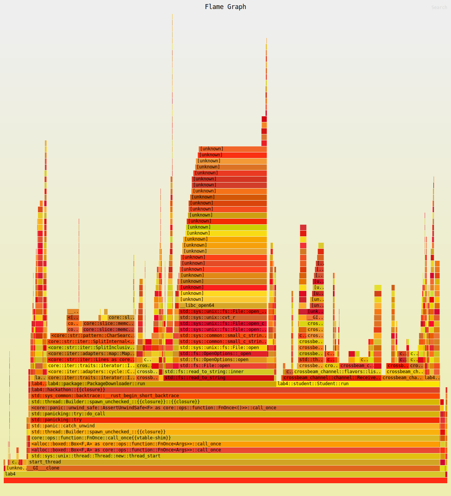
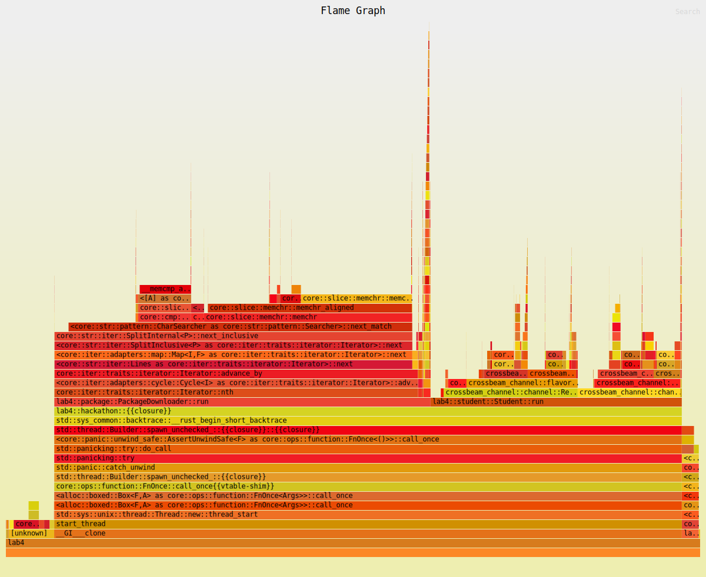
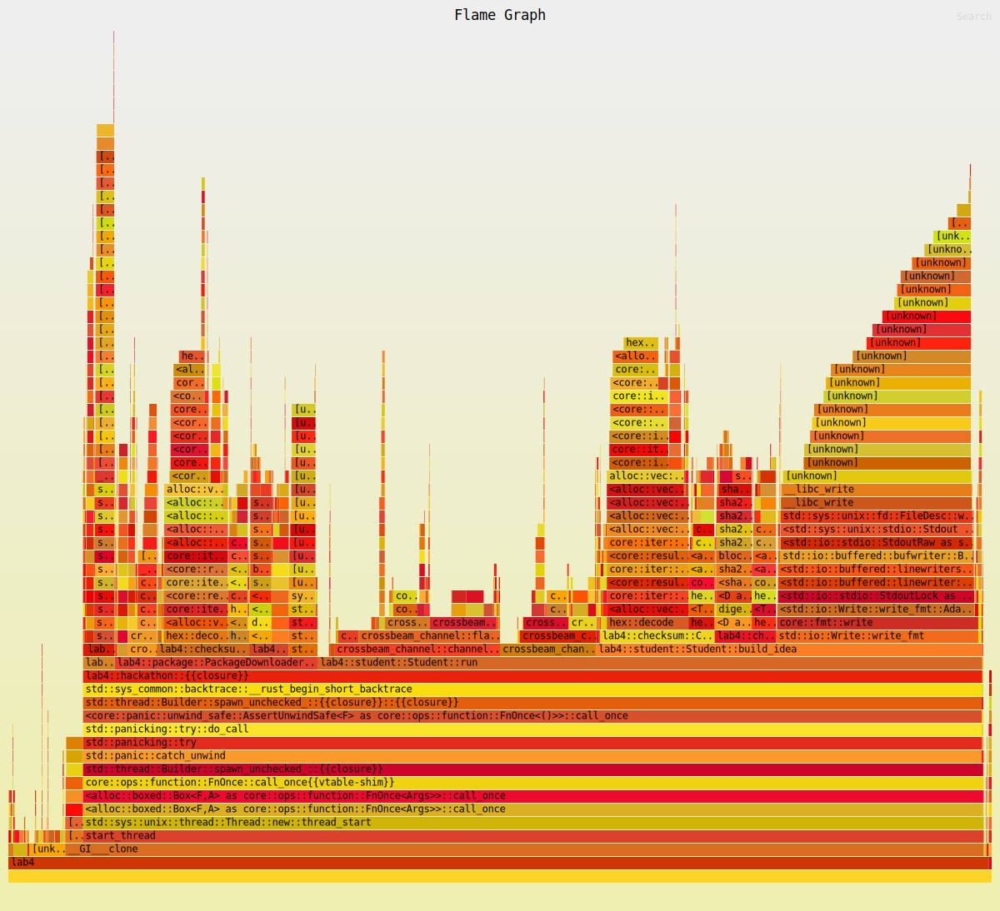
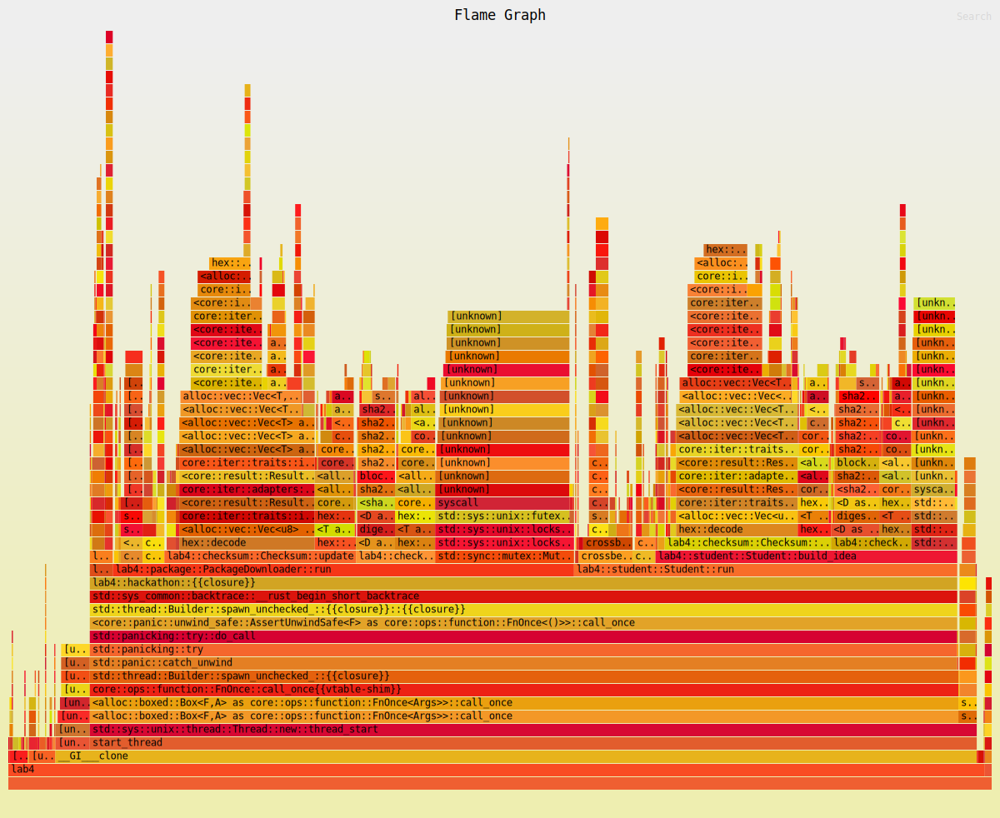
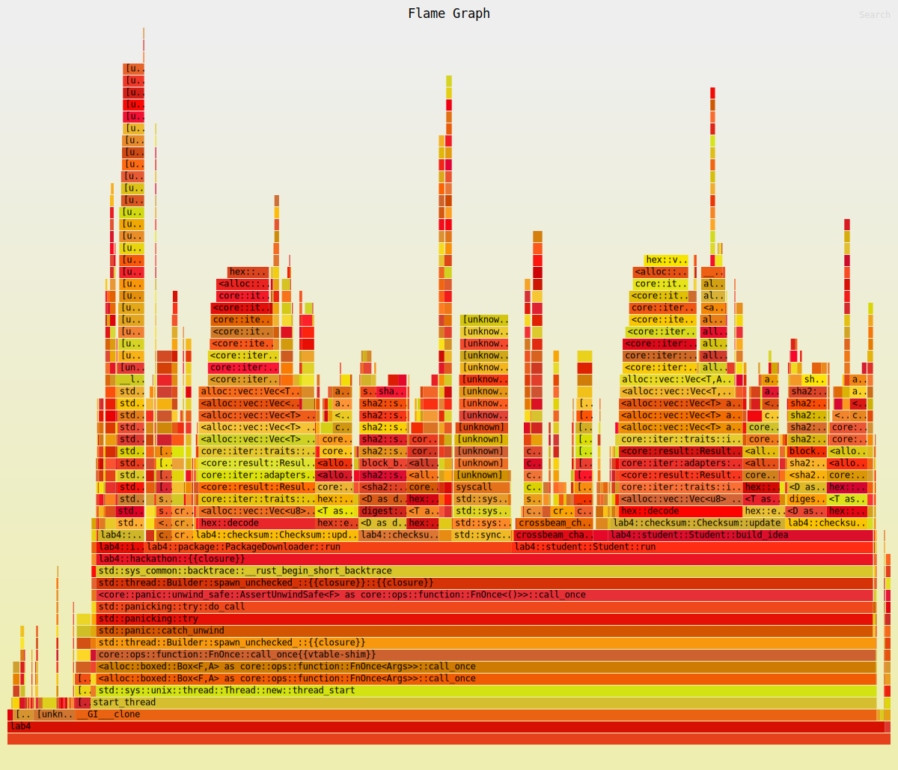
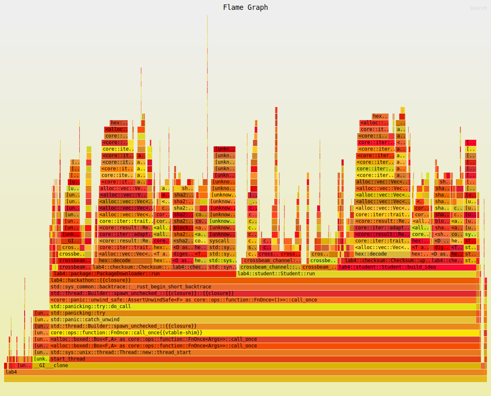
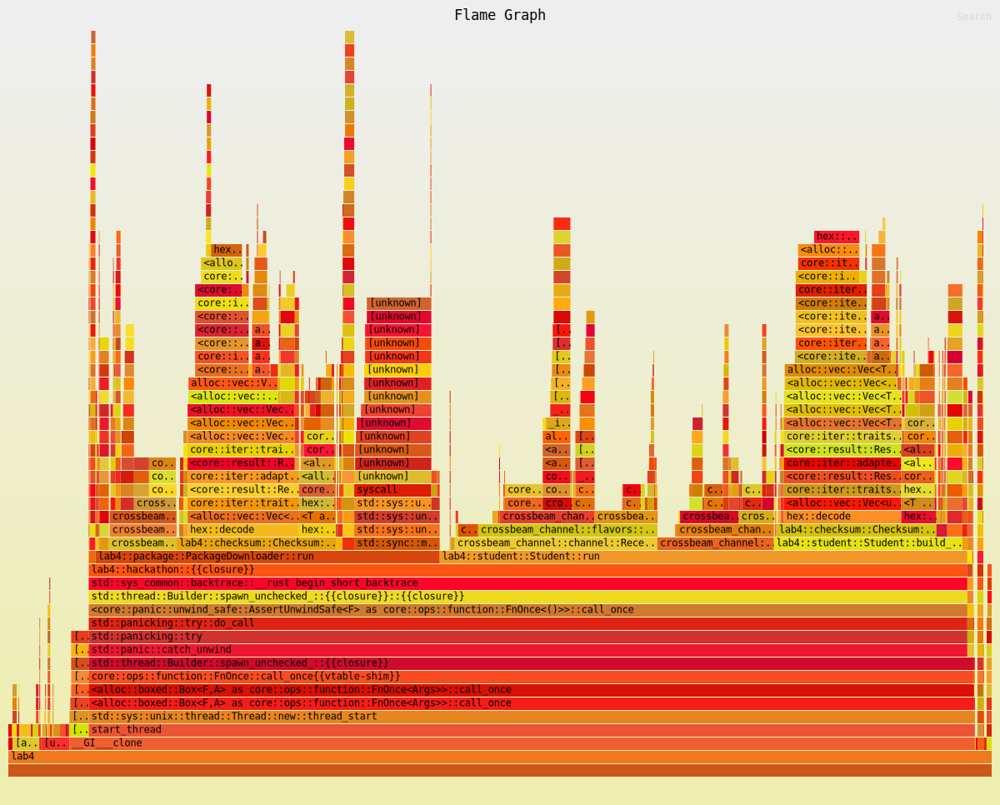
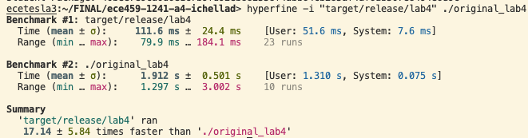

# Title

Optimized Hackathon simulation to a speedup of 17x.

# Summary

Iteratively examined flamegraphs to pinpoint promising areas to speed up. Derived speedups by reducing repetitive file reads, ommitting intermediate print statements, performing in-place XOR operations, ommitting matrix generations, and implementing caches for hash values.

# Technical details

Initially, my flamegraph had a somewhat high amount of unknowns, which I did not like (although in retrospect, they really did not matter):

For this reason, all of my future flamegraphs were generated with the package number parameter set to 100,000 (as opposed to the default of 4000) This is the first flamegraph generated using this setting, that we will be use as a baseline:

Looking at the flamegraph, the first thing that I wanted to try to optimize was the `core::iter::traits::iterator::Iterator::nth` chunk. Delving into the code, it is apparent this is referring to the .nth() call that follows the file read that occurs `num_pkgs` times in each `PackageDownloader` thread. The obvious optimization was to move the file read outside the for loop reulting in `1` file read per `PackageDownloader` thread, the caveat being that we would no longer be able to use .cycle() if we did not use .nth(), so I simply used some math involving the modulo operator to cycle my indices manually.

After this I verified that this change did not alter the outputs and resulted in a speedup using hyperfine (which I did after every step listed here). The resulting flamegraph from this change is:

The next glaring area to target from flamegraph analysis is `lab4::student::Studnet::build_idea`, more specfically the `std::io::Write::write_fmt` chunk within it. After doing some investigation I concluded that this chunk must pertain to the intermediate print statements being made by the `build_idea()` function within `Student`. I found these print statements annoying and unnecessary, so I just removed them entirely. This resulted in:

When I analyzed this flamegraph, I concluded that I wanted to target the `lab4::checksum::Checksum::update` chunk (a mistake, I will explain why shortly), and ended up targetting the XOR function occuring within the function. I replaced the original XOR which created a new variable with an in-place version. This resulted in:

When comparing the 2 latter flamegraphs, it is hard to point out meaningful differences. This is because I made an error in my analysis of the second-last flamegraph which led me to make the latest change. Within the `lab4::checksum::Checksum::update` chunk, one can see it is dominated by `hex::decode` and `hex::encode` (chunks which I cannot target due to the lab requirements), which means I was wrong to target the XOR operation (which I decided on by scanning the `update` function by eye instead of delving further into the flamegraph). 

For my next change I targetted the `lab4::idea::IdeaGenerator::get_next_idea_name` chunk. Depending on the display size of the flamegraph, you might not even see that chunk in the flamegraph. I found this chunk because the `IdeaGenerator::run` chunk which was previously obscured was finally visible to me and it was being dominated by this `get_next_idea_name()` function. Observing the function, it is obvious what optimizations should be made. Like our first change, two files are being repeatedly loaded and read, so I moved the reads out such that they would each only be read once per thread. The other glaring issue was the repetitive call of `cross_product()`, which took the two ideas files' values and created an MxM matrix of their combinations. Instead of generating a matrix every time, I implemented some indexing logic to simply retrieve the applicable values from both the customers and products values and then combining them (reminiscent of some logic I implemented for lab 3). This resulted in the following flamegraph:

Analyzing the graph I set my sights on the two `lab4::checksum::Checksum::with_sha256` chunks. Admittedly, I'd previously attempted to optimize this block to no success. The goal was to reduce the number of calls to the `with_sha256` function, so I tried changing the provided structs to stop storing `name` value and instead the hashed versions of the values themselves, which I could not get working, I also tried reading the data files and writing copies of them that contained the hashed values instead, but I gave up after realizing how the `cross_product()` function was being utilized and getting disuaded. 

For this final attempt, I decided to use global hashmaps for each set of values. The major caveat to this approach is RAW issues, meaning I needed to either implement atomic updates or a locking system. I decided to go with a locking system. It is also important to note at this point that `lazy_static` would have been very useful at this point but I chose not to use external crates as I was not aware that I was allowed to at the time. For this locking system, I wanted it to be performant, and the major performance issue with a vanilla implementation (such as `Mutex`) would have been that I would have to lock every time I not only wrote to the hashmap but **read** from it. This would obviously be an issue as there are many, many reads being performed. After doing some research I decided to use a `RwLock` instead of a `Mutex`. This would enable me to use the `read()` lock (which would **not** bar other threads from reading simultaneously), and the `write()` lock (which would). By distributing the various hashmaps amongst the relevant threads using `Arc::clone()`, I was able to create global hashmaps. I then used the `RwLock`'s two locks to write a function which enabled me to retrieve the hash value for a name if it existed in my map and store the hash value (which I would have to calculate) otherwise.

This resulted in my final flamegraph:

# Testing for correctness

After each change I made, I ensured my code was correct by regression testing the global checksums against those from the original lab implementation (I saved the original binary as per advice I read on piazza).

# Testing for performance.

As demonstrated in my above flamegraphs (almost) all of my changes resulted in obvious changes in the flamegraph. These changes were also all directly linked to the sections of code we made alterations to (each connection explained above). 

*Note for grading: I realize at this point, that my explanations in the Technical Details section encompass what I should have discussed here, I apologize for the inconvenience, and ask that you account for the above explanations and graphs when marking this section.*

With regards to runtimes, I followed the scheme for performance testing described in [this piazza post](https://piazza.com/class/lqo45mpkvjd29f/post/506). I tested my speedup against the original implementation after making each change. I ran the hyperfine comparison multiple times back-to-back in order to get a general sense for the performance speedup. For my final implementation, I also did sporadic tests at random times afterwards within an hour timespan (in order to sample data at different server loads). All of this testing was performed on `ecetesla3`. The common baseline (lower bound) speedup I observed from my final implementation was 17ish (always greater than 17). An example comparison output (with my lowest observed performance speedup): 

At this point I felt comfortable concluding my code likely resulted in a 17x speedup, which is well above the 13.5x speedup requirement, so I decided to call it quits. It is also somewhat worth nothing that even to the human eye the difference in runtimes between the original implementation binary and my final is significant.